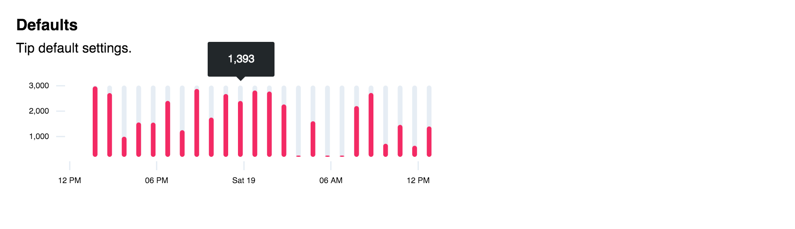

# D3 tipy.

 D3 tooltip. See source for examples and documentation.



## Installation

```
$ npm install d3_tipy
```

## Developing

Build:

```
$ make build
```

Start dev server:

```
$ make start
```
